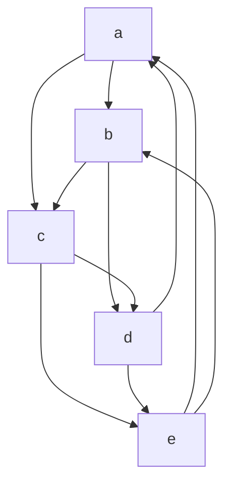

# mermaid
Mermaid experiments

```mermaid
graph TD;
  A-->B;
  A-->C;
  B-->D;
  C-->D;
```

```mermaid
graph TD;
  a --> b;
  a --> c;
  b --> c;
  b --> d;
  c --> d;
  c --> e;
  d --> e;
  d --> a;
  e --> a;
  e --> b;
```
