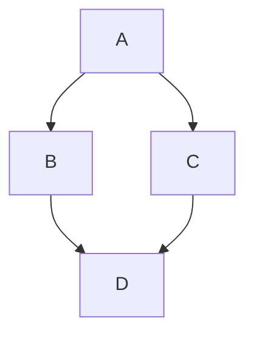
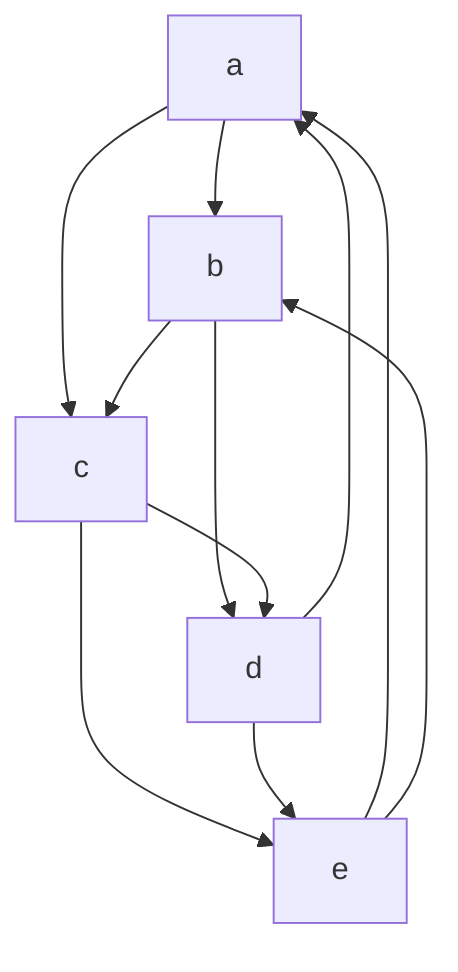
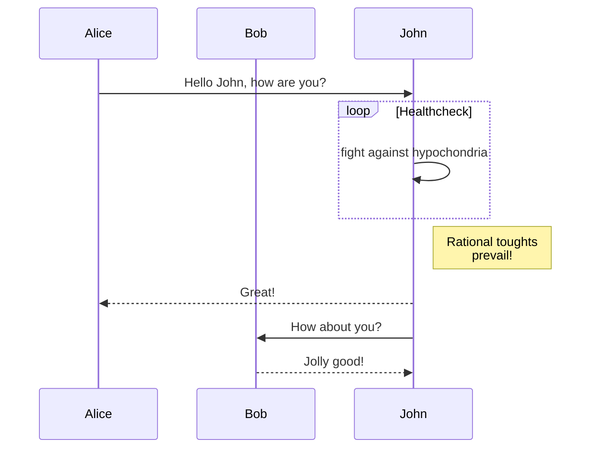
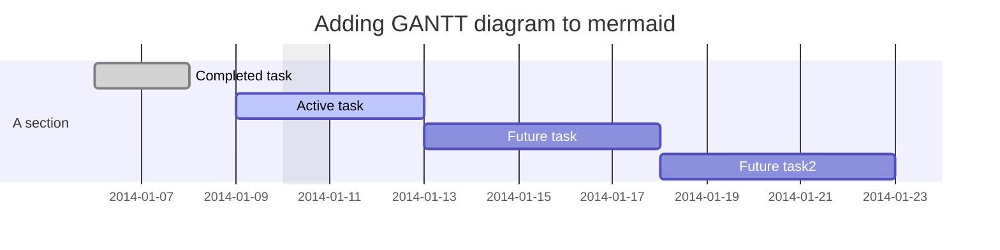

# mermaid
Mermaid experiments

## Graphs and Flowcharts

```mermaid
graph TD;
  A-->B;
  A-->C;
  B-->D;
  C-->D;
```

```mermaid
graph TD;
  a --> b;
  a --> c;
  b --> c;
  b --> d;
  c --> d;
  c --> e;
  d --> e;
  d --> a;
  e --> a;
  e --> b;
```

## Sequence diagrams

```mermaid
sequenceDiagram
  participant Alice
  participant Bob
  
  Alice->>John: Hello John, how are you?
  
  loop Healthcheck
    John->>John: fight against hypochondria
  end
  
  Note right of John: Rational toughts <br/>prevail!
  
  John-->>Alice: Great!
  John->>Bob: How about you?
  Bob-->>John: Jolly good!
```

## Gant diagrams

```mermaid
gantt
dateFormat YYYY-MM-DD
title Adding GANTT diagram to mermaid
excludes weekdays 2014-01-10

section A section
Completed task :done,   des1, 2014-01-06, 2014-01-08
Active task    :active, des2, 2014-01-09, 3d
Future task    :        des3, after des2, 5d
Future task2   :        des4, after des3, 5d
```
